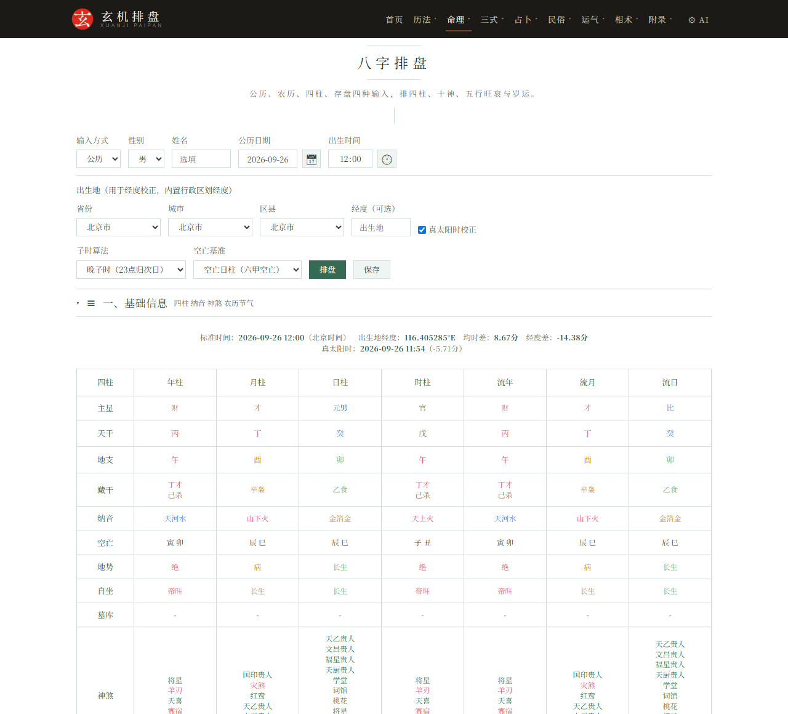
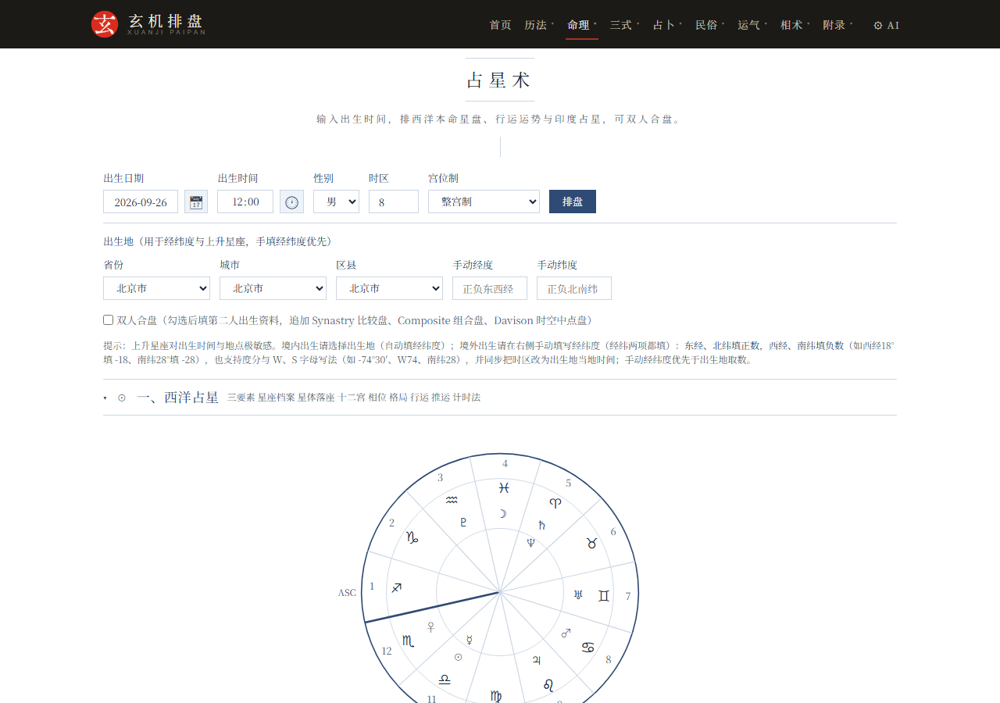
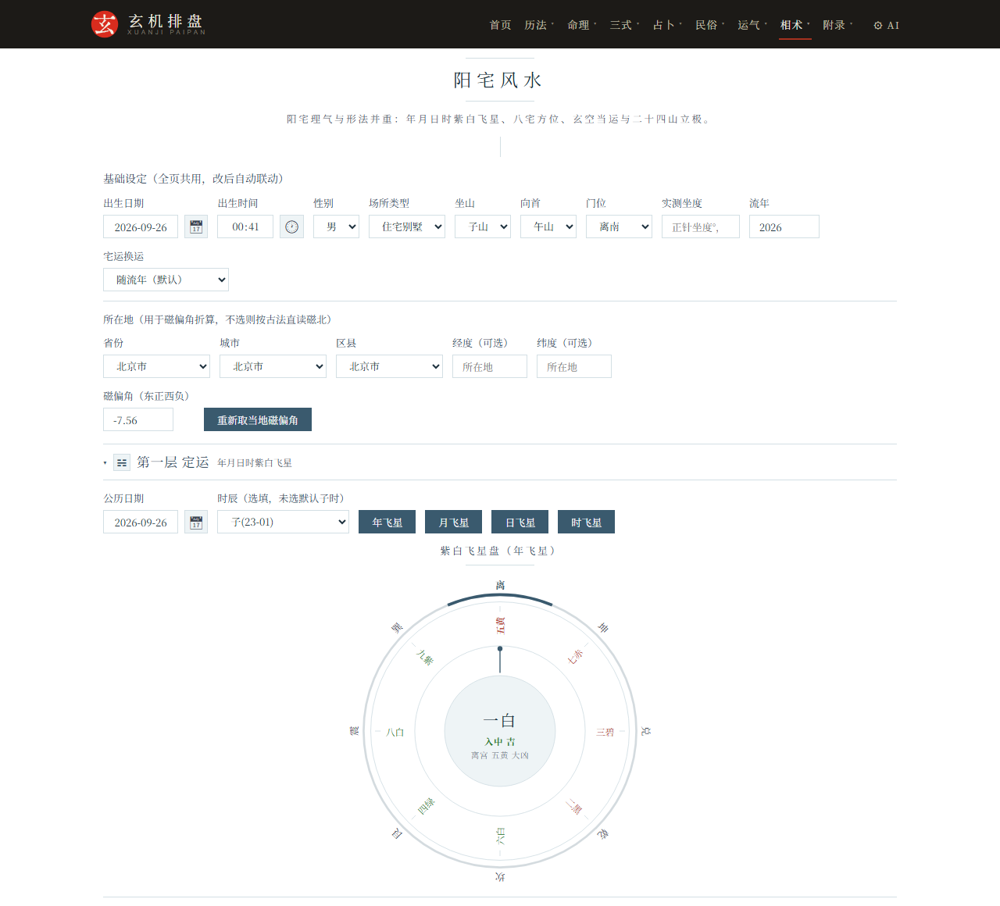

# 玄机排盘 XuanJi PaiPan

<div align="center">
  

[](https://github.com/GaoRenYouShu/XuanJiPaiPan/deployments)
[](https://xuanjipaipan.vercel.app/)
[](https://xuanjipaipan.pages.dev/)
[](https://app.netlify.com/projects/gregarious-duckanoo-ed4d5b/deploys)

[](LICENSE)
[](https://github.com/GaoRenYouShu/XuanJiPaiPan/commits/main)
[](#功能总览)
[](#技术构成)
[](#技术构成)
[](#技术构成)
</div>

传统命理、历法与占卜文化研究演示站。纯前端静态应用，无需后端，打开即用。

**在线体验**（四路镜像同源同步，任选其一）：

- GitHub Pages：https://gaorenyoushu.github.io/XuanJiPaiPan/
- Vercel：https://xuanjipaipan.vercel.app/
- Cloudflare Pages：https://xuanjipaipan.pages.dev/
- Netlify：https://xuanjipaipan.netlify.app/

四条线路同源同步，速度因访问地与线路而异：GitHub Pages 在国内首次加载较慢（样式与字体按需加载，数秒后正常），可自测选最快的镜像使用。

## 功能总览

涵盖历法、命理、三式、占卜、民俗、运气、相术七大类，共 34 个独立工具。

| 分类 | 工具 |
|---|---|
| **历法** | 万年历、老黄历、佛历、道历、藏历、择日、皇极经世 |
| **命理** | 八字排盘、八字合婚、紫微斗数、河洛理数、铁板神数、姓名学、占星术、七政四余 |
| **三式** | 奇门遁甲、大六壬、太乙神数 |
| **占卜** | 六爻、梅花易数、小六壬、灵签、塔罗牌、雷诺曼 |
| **民俗** | 民俗占法、测字、周公解梦、二十八宿、太岁生肖 |
| **运气** | 五运六气 |
| **相术** | 手相、面相、阳宅风水、阴宅风水 |

## 界面预览

| 八字排盘 | 紫微斗数 |
|:---:|:---:|
|  |  |
| **占星术** | **阳宅风水** |
|  |  |
| **六爻** | **塔罗牌** |
|  |  |

## 主要工具

按站内七卷顺序逐件介绍。

### 历法（7 件）

- **万年历**：公历农历干支互查、二十四节气、节假日标注，百年历表快速翻阅
- **老黄历**：宜忌、冲煞、吉凶神、纳音、建除、二十八宿、九宫飞星、时辰吉凶
- **佛历**：佛历纪年与公历农历对照，佛诞、卫塞节等佛教节日标注
- **道历**：道历纪年与公历农历对照，三元、八节等道教节日标注
- **藏历**：时轮历浦派算例，饶迥纪年、五行生肖、重日缺日、殊胜日与流派差异
- **择日**：黄历择吉与造命择日两套判据分列
- **皇极经世**：邵雍元会运世体系，任一公历年（支持公元前）的四级定位、十二会辟卦与大事锚点

### 命理（8 件）

- **八字排盘**：四柱、十神、大运、喜用神、十神经典断语、命局断事
- **八字合婚**：六维评分、喜忌互补，两盘并排比对
- **紫微斗数**：十二宫、主星与辅星、四化、命身宫
- **河洛理数**：八字化数起先天卦，元堂变爻出后天卦，阳九阴六排大运，流年流月流日流时逐层变爻
- **铁板神数**：太玄化数、八刻考时定刻、皇极总数、条文抽演，支持从八字页带入出生信息
- **姓名学**：五格剖象、三才配置、三运关系、八十一数理，支持八字喜用神联动
- **占星术**：本命星盘，日月至上升诸星落座落宫与相位角度一览
- **七政四余**：十一曜躔宫入宿、洞微大限，真黄经由 VSOP87 星历推算

### 三式（3 件）

- **奇门遁甲**：时家奇门九宫布局，三奇六仪、八门九星八神、格局用神自动标注
- **大六壬**：自动起天地盘、四课三传，配十二天将与课体格局，断吉凶应期
- **太乙神数**：太乙积年推算、十六神布局、主客算与大小游

### 占卜（6 件）

- **六爻**：铜钱、数字、时间等七种起卦，自动装卦排六亲六神世应，标注旬空月破与神煞应期，支持真太阳时与连占对比
- **梅花易数**：时间起卦，自动分体用、排互卦变卦错综，按体用生克与卦气旺衰断吉凶应期
- **小六壬**：大安、留连、速喜、赤口、小吉、空亡六神掌诀，月日时三数即断
- **灵签**：黄大仙、观音、月老、关公等签文抽签解签，签诗、古人典故与吉凶释义
- **塔罗牌**：韦特体系 78 张原版牌图，六种牌阵，逐张正逆位关键词与分域牌义、占星对应
- **雷诺曼**：36 卡七种牌阵，630 对全组合词典成句，扑克对应、指标牌宫位与马步读法

### 民俗（5 件）

- **民俗占法**：称骨算命、犯月查询、本命佛、手机号八星磁场、三世书
- **测字**：精编拆字字典，含随问取拆多拆法、六书标注、加笔减笔活拆变象、部件释义、康熙数理、梅花字占卦象、时辰外应与值日冲日应期
- **周公解梦**：通行本二十七类九百五十一句占辞全文，双底本对照，关键词检索与分类浏览
- **二十八宿**：本命宿、演禽、值宿宜忌，附十二宫次分野、二十四山配宿与《天官书》占辞
- **太岁生肖**：流年犯太岁判定（值冲刑害破合），十二生肖年度月度运程，六十甲子太岁星君全传

### 运气（1 件）

- **五运六气**：岁运、司天在泉、客主加临、运气同化

### 相术（4 件）

- **手相**：掌形七类与九宫八丘、三大主线与辅助线纹，勾选式自查计分，条文照录《麻衣相法》
- **面相**：三停、面形七类、五官、气色痣相与十二宫定位条文对照，附自查计分与古籍原图
- **阳宅风水**：年月日时紫白飞星、八宅吉凶方位、二十四山坐山立极、流年太岁避煞，罗盘内置 WMM2025 地磁模型校正磁偏角，宅为体、年为用综合诊断
- **阴宅风水**：峦头觅龙察砂观水点穴、玄空飞星坐向、三合水法与八煞黄泉桃花水、仙命配山与二十八宿分金，安葬择日避重丧复日四离四绝

各占卜工具均支持流派与算法切换，结果实时计算。

## 站内导航

顶部导航按八卷编排：历法、命理、三式、占卜、民俗、运气、相术，另有附录三类。

- **典籍参考** `dianji.html`：各模块所依典籍、版本与开放获取渠道
- **说明文档** `shuoming.html`：每个工具的起例口径、流派取舍、源流考据、凡例与术语解说
- **算法数据** `opensource.html`：开源算法库与数据来源清单，各条注明许可与实装页面

## 技术构成

- 纯 HTML、CSS 与原生 JavaScript，无构建步骤，静态部署即可运行
- 可安装到桌面与主屏幕（PWA），已访问页面断网可用；跟随系统自动切换深浅色主题
- 历法引擎基于 [lunar-javascript](https://github.com/6tail/lunar-javascript)（MIT）
- 紫微斗数排盘基于 [iztro](https://github.com/SylarLong/iztro)（MIT）
- 占星星历基于 [astronomy-engine](https://github.com/cosinekitty/astronomy)（MIT）
- 字体自托管（SIL OFL 1.1），离线可用；完整清单见 `opensource.html`

## 本地运行

任意静态服务器即可：

```bash
cd XuanJiPaiPan
python -m http.server 8080
# 打开 http://localhost:8080
```

也可以直接双击 `index.html` 打开，脚本按相对路径加载，离线可用。

## 在线部署

纯静态零构建，Fork 到自己账号后任选一家托管，任意域名与子路径都无需改动源码：页面内的 canonical、og:url 与分享图链接由 `assets/meta.js` 按实际访问地址自动生成，404 页各平台自动识别。

- **GitHub Pages**：仓库 Settings → Pages → Source 选 Deploy from a branch，Branch 选 main 与根目录（`(root)`）。
- **Vercel**：在 vercel.com/new 导入仓库，Framework Preset 选 Other，构建命令留空、输出目录 `./`；缓存与 URL 规则已由 `vercel.json` 给定，保持默认即可。
- **Cloudflare Pages**：控制台 Workers 和 Pages → 创建 → Pages → 连接到 Git，预设选 None，构建命令留空、输出目录 `/`。
- **Cloudflare Workers（命令行直传）**：`npm i -g wrangler`，`wrangler login` 后在本目录执行 `wrangler deploy`；配置见 `wrangler.jsonc`，上传排除清单见 `.assetsignore`。
- **Netlify**：在 app.netlify.com 导入仓库，构建命令留空、发布目录 `./`。
- **其他托管**：任意静态托管或对象存储加 CDN（阿里云 OSS、腾讯云 COS、EdgeOne Pages、Render 等）将仓库文件原样上传即可，无需服务端。

## 仓库数据

| 仓库概览 | 语言构成 |
|:---:|:---:|
| [](https://github.com/GaoRenYouShu/XuanJiPaiPan) |  |

### 提交活动


## 目录结构

```
XuanJiPaiPan/
├── *.html        39 个页面：34 个工具加首页、附录三类与 404 页
├── assets/       全部脚本、样式、字体与图源
├── manifest.webmanifest 与 sw.js   PWA 清单与离线 Service Worker
├── vercel.json   Vercel 部署配置（URL 规则与字体缓存）
├── wrangler.jsonc 与 .assetsignore  Cloudflare Workers 静态资产部署配置
├── .nojekyll     GitHub Pages 免 Jekyll 处理
├── LICENSE       MIT 许可文本
├── README.md
├── robots.txt
└── sitemap.xml
```

网页运行只需根目录的页面与 `assets/` 两项，不含任何外部目录依赖。

## 开源协议

本项目采用 [MIT License](LICENSE)。

- 可免费使用，包括个人使用、商业项目与二次开发
- 使用或分发时请保留本项目版权声明与出处，并在显著位置注明仓库链接
- 引入的第三方开源库版权归其原作者所有，各自遵循其许可

## 数据来源与致谢

- [6tail/lunar-javascript](https://github.com/6tail/lunar-javascript)：历法数据底座（MIT）
- [SylarLong/iztro](https://github.com/SylarLong/iztro)：紫微斗数引擎（MIT）
- [cosinekitty/astronomy-engine](https://github.com/cosinekitty/astronomy)：占星星历（MIT）
- [Wikimedia Commons](https://commons.wikimedia.org/wiki/Category:Rider-Waite_tarot_deck)：韦特史密斯塔罗 78 张公有领域牌图（Pamela Colman Smith 绘，1909）
- [Unicode Unihan 数据库](https://www.unicode.org/charts/unihan.html)：康熙笔画字库数据源（Unicode Data Files License）
- CBDB 中国历代人物传记资料库：姓名学人物资料（CC BY-NC-SA 4.0）
- 京都大学人文科学研究所汉籍资料库（Kanripo）、维基文库：古籍全文底本（公有领域与 CC BY-SA）

完整清单与逐条许可见 `opensource.html`。

## 免责声明

本项目为传统文化研究与娱乐演示，所有排盘、择日、占卜结果仅供文化研究参考，请勿迷信。重大决策请以专业意见为准。排盘计算依各模块主流口径实现，解读文字为传统命理文化演绎。

## 联系方式

[](https://t.me/gaoren)
